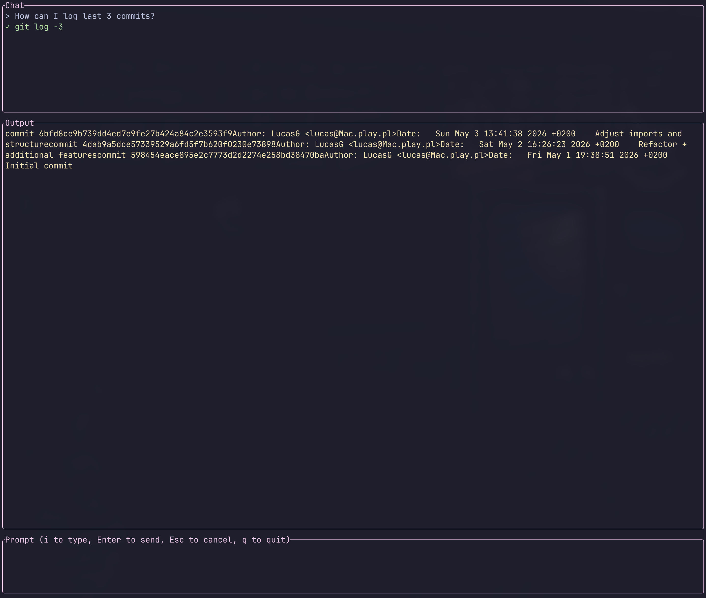

# gitEZ

A terminal UI for running git commands using natural language (part of my learning Rust joruney :)).



## Features

- Ask for git commands in plain English
- Review and edit commands before execution
- See shell output directly in the TUI
- Runs fully local via Ollama — no API keys needed

## Demo

> "how do I push my current branch to a new remote branch?"

gitez sends your request to the LLM, shows the suggested commands, and lets you run them one by one — editing inline if needed.

## Requirements

- [Rust](https://rustup.rs/)
- [Ollama](https://ollama.com/) running locally

## Installation

```bash
git clone https://github.com/lukgra/gitez
cd gitez
cargo run
```

## Usage

| Key          | Action                     |
| ------------ | -------------------------- |
| `i`          | Start typing a request     |
| `Enter`      | Send request / run command |
| `Esc`        | Cancel                     |
| `q`          | Quit                       |
| `←` `→`      | Move cursor                |
| `Home` `End` | Jump to start / end        |

## Built with

- [ratatui](https://github.com/ratatui-org/ratatui) — TUI framework
- [crossterm](https://github.com/crossterm-rs/crossterm) — terminal backend
- [tokio](https://tokio.rs/) — async runtime
- [reqwest](https://github.com/seanmonstar/reqwest) — HTTP client
- [Ollama](https://ollama.com/) — local LLM
